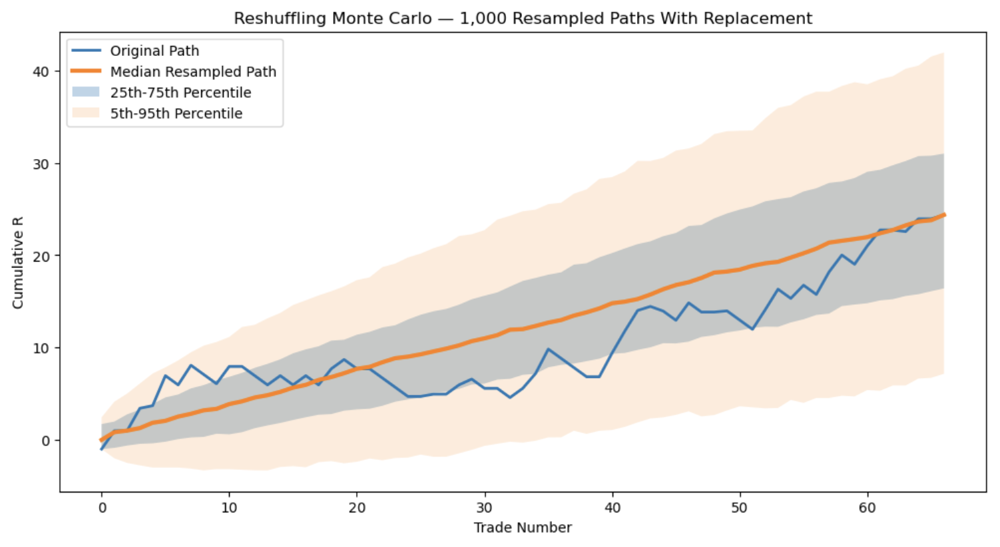
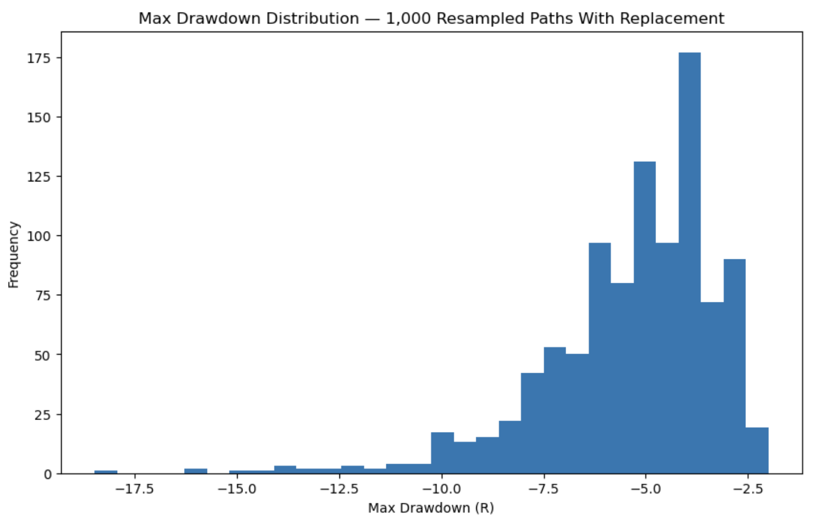
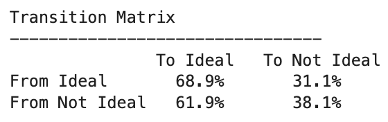
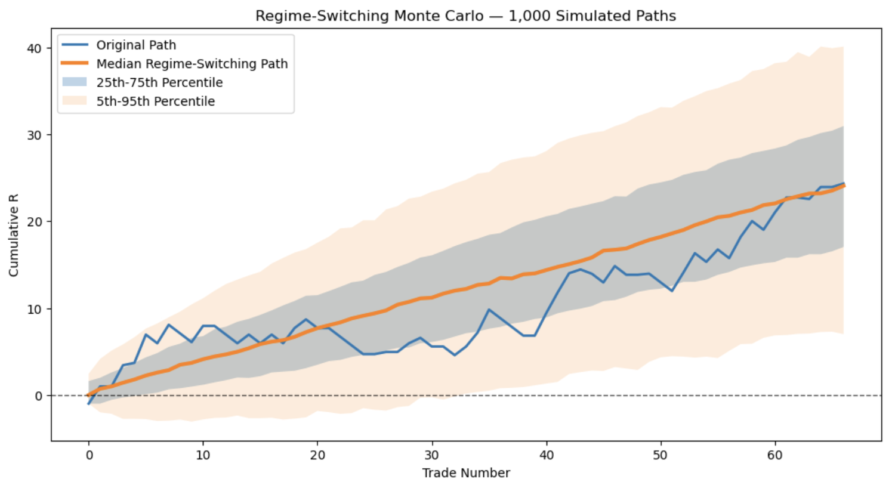
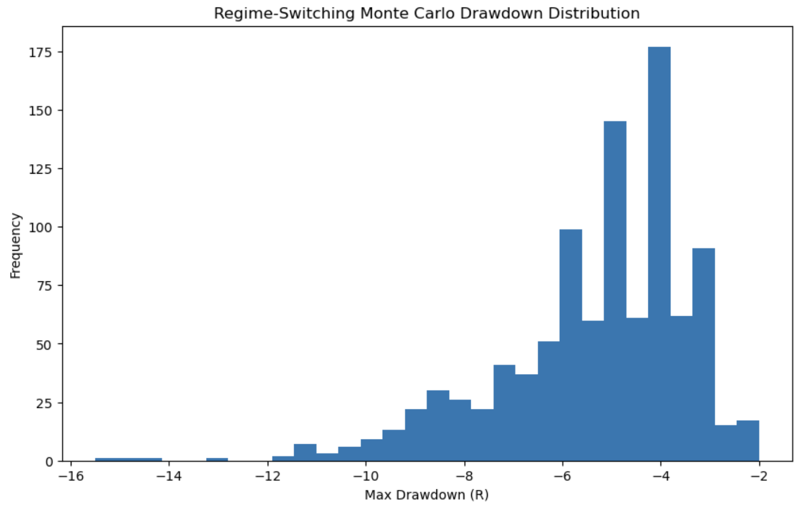

# Monte-Carlo-and-Regime-Switching-Analysis-of-a-Futures-Trading-Strategy

Bootstrap and regime-switching Monte Carlo simulations used to evaluate the robustness, risk, and drawdown characteristics of a discretionary NQ futures trading strategy.

## Skills Demonstrated:
Python | Pandas | NumPy | Statistical Modeling | Monte Carlo Simulation | Data Visualization | Financial Markets

## Project Overview

Using Python, Pandas, NumPy, and Matplotlib, this project analyzes the robustness of a discretionary futures trading strategy through two Monte Carlo frameworks:

1. Bootstrap Monte Carlo Simulation
2. Regime-Switching Monte Carlo Simulation

The objective was to determine whether the strategy's historical performance remained statistically robust when trade order and market conditions were randomized across thousands of simulated paths.

## Dataset

- 67 historical trades
- Performance measured in R-Multiples
- Trades classified into two market regimes:
  - Ideal
  - Not Ideal

## Tools Used

- Python
- Pandas
- NumPy
- Matplotlib

## Monte Carlo #1: Bootstrap Simulation

### Objective

The first simulation tested whether the strategy's profitability was dependent on the historical ordering of trades.

### Methodology

Before performing bootstrap simulations, it is useful to first understand simple trade reshuffling.

Imagine all 67 historical trades are written on slips of paper and placed into a hat.

### Trade Reshuffling (Without Replacement)

- Pick a trade from the hat
- Write it down
- Leave it out of the hat
- Continue until all 67 trades have been selected

This changes only the order of trades while preserving the exact historical distribution of winners and losers.

### Trade Reshuffling Example

The original trade sequence was randomly reordered without replacement. This preserved the exact trade distribution while demonstrating how trade sequencing alone can affect the equity curve.

Trade reshuffling provides a useful foundation because it isolates the impact of trade sequencing while keeping the underlying performance distribution unchanged. However, it is limited to the exact set of historical trades.

To generate entirely new but statistically similar trade histories, the analysis uses bootstrap sampling with replacement. This approach allows individual trades to appear multiple times or not at all, creating thousands of alternative paths while preserving the overall characteristics of the strategy.

### Bootstrap Sampling (With Replacement)

Bootstrap sampling extends this idea by returning each selected trade back into the hat before the next draw.

- Pick a trade from the hat
- Write it down
- Put it back into the hat
- Repeat 67 times

Because each trade is returned to the hat after selection, some trades may appear multiple times while others may not appear at all. This creates entirely new but statistically similar trade sequences while preserving the underlying characteristics of the strategy.

A total of 1,000 bootstrap simulations were generated to estimate the distribution of potential future outcomes.

### Bootstrap Monte Carlo Equity Curve Distribution

### Drawdown Distribution

 

### Drawdown Statistics

- Average Drawdown: -5.35R
- Median Drawdown: -5.00R
- Worst Drawdown: -18.48R
- 5th Percentile Drawdown: -9.32R

### Key Findings

- The median bootstrap path remained profitable across 1,000 simulations.
- The original equity curve finished near the center of the simulated distribution.
- Most simulated paths experienced maximum drawdowns between approximately 3R and 7R.
- Randomizing trade outcomes did not eliminate the strategy's positive expectancy.
- Performance appeared robust to trade sequencing, suggesting profitability was not dependent on a specific historical order of trades.

### Conclusion

The strategy remained profitable across a wide range of simulated trade sequences, suggesting that historical performance was not solely dependent on trade order. Bootstrap results indicated that the strategy's edge persisted across many alternative paths generated from the same underlying trade distribution.

# Monte Carlo #2: Regime-Switching Simulation

## Objective

The second simulation tested whether the strategy remained profitable when trade outcomes were generated according to changing market regimes rather than simple random resampling.

Unlike bootstrap sampling, which treats every trade as equally likely, regime-switching simulations account for the tendency of market conditions to persist over time.

## Regime Classification

Historical trades were classified into two market environments:

- Ideal
- Not Ideal

These classifications were based on discretionary pre-market notes recorded before each trading session.

Examples of conditions that were often classified as Not Ideal included:

- Trading days immediately before major economic releases such as FOMC meetings or CPI reports
- Sessions following unusually large range expansion days
- Market environments that historically produced less consistent price action

Ideal conditions generally represented market environments where the strategy's setup characteristics were more favorable based on historical observation.

While the classification process was discretionary, it was recorded prior to each trading session and used consistently throughout the dataset.

## Transition Matrix

The transition matrix measures the probability of moving between market regimes from one trade to the next.

These probabilities were estimated directly from the historical trade data and were used to generate realistic sequences of market conditions during the simulation. Rather than randomly assigning market states, the model allows regimes to persist and transition in a manner consistent with historical observations.

## Regime-Switching Monte Carlo Equity Curve Distribution

Using the transition probabilities from the matrix above, 1,000 regime-switching simulations were generated.

For each simulated trade, the model first determined the market regime based on the transition matrix and then randomly selected a historical trade outcome from that regime. This process preserved both the performance characteristics of each regime and the tendency for market conditions to persist over time.

The blue line represents the actual historical equity curve, while the orange line represents the median simulated outcome. The shaded regions display the 25th–75th percentile and 5th–95th percentile ranges across all simulations.

## Drawdown Distribution

The distribution below shows the maximum drawdown experienced across all 1,000 regime-switching simulations.

### Drawdown Statistics

- Average Drawdown: -5.34R
- Median Drawdown: -5.00R
- Worst Drawdown: -15.5R
- 5th Percentile Drawdown: -9.05R

## Conclusion

The strategy remained profitable across the majority of simulated regime sequences. While market conditions shifted between Ideal and Not Ideal environments, the overall distribution of outcomes remained favorable.

The similarity between the bootstrap and regime-switching results suggests that the strategy's edge is not dependent on a specific historical trade sequence or a single market environment. Even after accounting for regime persistence, the strategy continued to exhibit robust profitability and manageable drawdowns.

## Key Findings

- The strategy remained profitable across the majority of simulated regime sequences.
- Performance was stronger during Ideal market conditions.
- Market regimes exhibited persistence rather than random switching.
- Drawdown characteristics remained similar to the bootstrap analysis.
- Results suggest the strategy's edge is robust across a variety of market environments and trade sequences.

# Final Takeaways

Using Python, this project evaluated a discretionary NQ futures trading strategy through two separate Monte Carlo frameworks:

1. Bootstrap Monte Carlo Simulation
2. Regime-Switching Monte Carlo Simulation

The bootstrap model tested whether the strategy's profitability was dependent on the historical ordering of trades, while the regime-switching model incorporated changing market environments and regime persistence.

Despite the additional complexity introduced by the regime model, both approaches produced remarkably similar results. Average drawdowns, median drawdowns, and overall equity curve distributions remained consistent across both simulations.

Key conclusions from the analysis include:

- The strategy maintained positive expectancy across thousands of simulated paths.
- Profitability was not dependent on a specific historical sequence of trades.
- Performance was stronger during Ideal market conditions.
- Drawdown characteristics remained stable across both simulation frameworks.
- The strategy demonstrated robustness across a variety of market environments and trade sequences.

While historical performance does not guarantee future results, both Monte Carlo frameworks suggest that the strategy's edge is not solely the product of randomness and has remained resilient under a wide range of simulated conditions.
